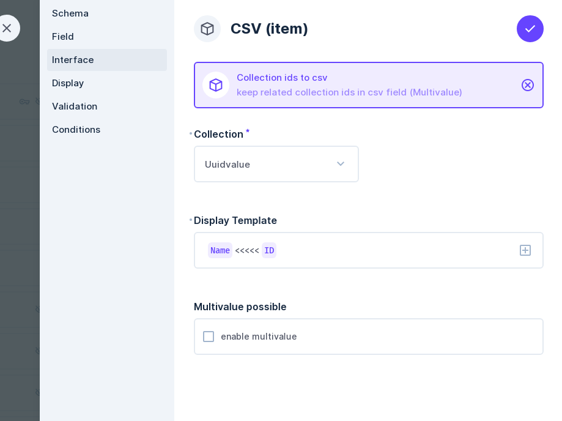
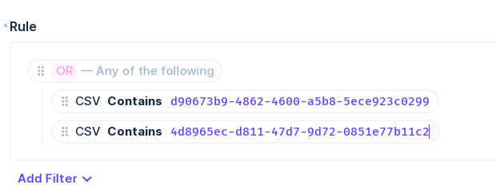

# Directus extension to make conditions under M2M fields values

First create CSV field and then make choice "Collection ids to csv" for interface

Select related collection

Adjust display for records 

Enable multiple value to be possible

